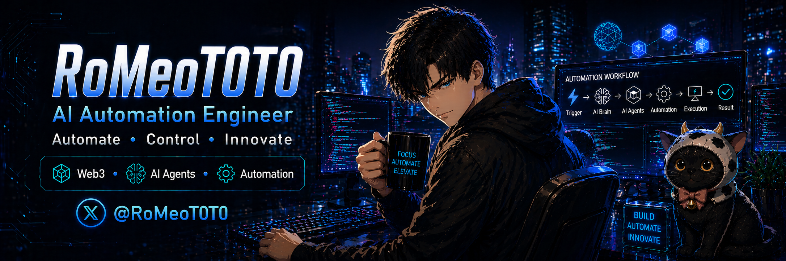

<!-- Profile Banner -->

<!-- Social Badges -->

<!-- Typing Animation -->

---

## 🧑‍💻 About Me

I build **AI-powered automation tools that solve real IT problems** — helpdesk chatbots, Telegram-based IT agents, AI-assisted work boards, and practical web tools. Based in **Bangkok, Thailand** 🇹🇭

> 🤖 **AI Automation Engineer** — specializing in Gemini API, Python automation & IT workflows
> 🌟 **1.8K+** Followers on X ([@RoMeoT0T0](https://x.com/RoMeoT0T0))
> 🔭 Currently building: [Monster Tapper](https://github.com/romeototo/monster-tapper) — premium idle RPG web game
> 🤝 Open to: AI automation · web tools · game jams · collaboration

---

## 🚀 Start Here

If you only inspect a few links, start with these:

| Priority | Link | Why it matters |
|----------|------|----------------|
| 1 | [Portfolio Website](https://romeototo.github.io/portfolio-website/) | Main hub with live demos, case studies, and the clearest project story |
| 2 | [IT Support AI Chatbot](https://github.com/romeototo/it-support-chatbot) | Flagship AI/IT project with 222 FAQs, ticket handoff, and admin workflow |
| 3 | [CCTV Playback Workspace Case Study](https://romeototo.github.io/portfolio-website/case-studies/cctv-playback-workspace/) | Sanitized private-ops case study showing practical workflow automation |
| 4 | [BKK Pattaya Taxi Case Study](https://romeototo.github.io/portfolio-website/case-studies/bkk-pattaya-taxi/) | Public product example with SEO, booking flow, and conversion-focused UI |

---

## ✅ Proof & Credibility

What I want this profile to prove quickly:

| Signal | Evidence |
|--------|----------|
| **Real IT automation** | [IT Support AI Chatbot](https://github.com/romeototo/it-support-chatbot) covers 222 FAQs across 50 support categories with ticket handoff and admin workflow |
| **Ops workflow thinking** | [CCTV Playback Workspace](https://romeototo.github.io/portfolio-website/case-studies/cctv-playback-workspace/) documents a private workflow as a sanitized public case study |
| **Product shipping** | [BKK Pattaya Taxi](https://romeototo.github.io/portfolio-website/case-studies/bkk-pattaya-taxi/) shows SEO, booking UX, and multi-channel lead capture in one public product |
| **Documentation discipline** | Active projects include English/Thai READMEs, project snapshots, demos, and clear start points |

---

## 🧭 Project Focus

I keep the profile focused on a few clear tracks instead of showing every experiment:

| Track | What it proves | Representative repos |
|-------|----------------|----------------------|
| **AI for IT operations** | FAQ automation, safe command workflows, support tooling | [IT Support AI Chatbot](https://github.com/romeototo/it-support-chatbot), [Telegram AI IT Agent](https://github.com/romeototo/telegram-ai-it-automation-agent) |
| **Productivity tools** | AI-assisted planning, realtime task UX, practical dashboards | [AI Kanban Board](https://github.com/romeototo/ai-kanban-board) |
| **Public web products** | SEO pages, booking flows, polished GitHub Pages demos | [BKK Pattaya Taxi](https://github.com/romeototo/bkk-pattaya-taxi), [Portfolio Website](https://github.com/romeototo/portfolio-website) |
| **Web games** | Interactive mechanics, progression loops, browser-based game UI | [Monster Tapper](https://github.com/romeototo/monster-tapper) |

---

## 🧩 Recently Shipped

- Refreshed the [portfolio hub](https://romeototo.github.io/portfolio-website/) into the main entry point for demos, case studies, and proof of work.
- Added a sanitized [CCTV Playback Workspace](https://romeototo.github.io/portfolio-website/case-studies/cctv-playback-workspace/) case study to show private operations work without exposing sensitive data.
- Added project snapshots across active repos so visitors can understand purpose, scope, and status without reading the full codebase.
- Archived older duplicate experiments so pinned and featured projects stay focused on current work.

---

## 🛠️ Tech Stack

**🔥 Primary (daily use)** 

  **⚡ AI & Cloud** 

---

## 🎯 Featured Projects

| | Project | Description | Tech | Status | Links |
|:---:|---------|-------------|:---:|:---:|:---:|
| 🖥️ | **[IT Support AI Chatbot](https://github.com/romeototo/it-support-chatbot)** | AI helpdesk handling 200+ FAQs across 50 categories — Gemini-powered responses, typewriter UI & dark/light mode |   |  | [📦 Repo](https://github.com/romeototo/it-support-chatbot) · [🔗 Demo](https://romeototo.github.io/it-support-chatbot/) |
| 📋 | **[AI Kanban Board](https://github.com/romeototo/ai-kanban-board)** | Real-time task board — drag & drop, Firebase auth, Gemini auto-decomposes tasks into subtasks |   |  | [📦 Repo](https://github.com/romeototo/ai-kanban-board) · [🔗 Live](https://romeototo.github.io/ai-kanban-board/) |
| 🤖 | **[Telegram AI IT Agent](https://github.com/romeototo/telegram-ai-it-automation-agent)** | System monitoring & ticket creation via Telegram — replaces manual IT checks with AI-guardrailed commands |   |  | [📦 Repo](https://github.com/romeototo/telegram-ai-it-automation-agent) |
| 🚕 | **[BKK Pattaya Taxi](https://github.com/romeototo/bkk-pattaya-taxi)** | Full-stack SEO landing page & booking system — React 19, tRPC, multi-channel notifications (Telegram/LINE/Email) |   |  | [📦 Repo](https://github.com/romeototo/bkk-pattaya-taxi) · [🔗 Live](https://romeototo.github.io/bkk-pattaya-taxi/) |
| 👾 | **[Monster Tapper](https://github.com/romeototo/monster-tapper)** | Premium idle/clicker RPG — boss battles, combo system, prestige mechanics & 10+ stages |  |  | [📦 Repo](https://github.com/romeototo/monster-tapper) · [🔗 Play](https://romeototo.github.io/monster-tapper/) |
| 🌐 | **[Portfolio Website](https://github.com/romeototo/portfolio-website)** | Dark-themed portfolio — glassmorphism effects, smooth animations, and responsive design |   |  | [📦 Repo](https://github.com/romeototo/portfolio-website) · [🔗 Live](https://romeototo.github.io/portfolio-website/) |

---

## 📊 GitHub Stats

<table>
<tr>
<td width="50%" valign="middle">

</td>
<td width="50%" valign="middle">

</td>
</tr>
</table>

> Note: Top languages reflect the public code mix in my repositories. They are not a complete skill ranking.

---

## 🏆 GitHub Trophies

---

&nbsp;

&nbsp;

  

⭐ **If you like my work, consider giving a star!** ⭐

 

<!-- Footer -->

